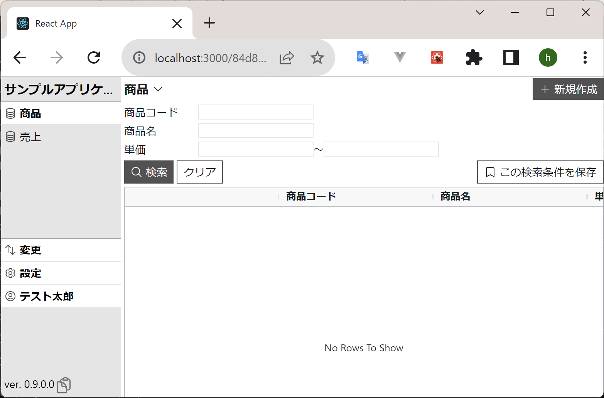

# HalApplicationBuilder 【開発中 under development】
データモデルを指定すると以下のものを作成してくれるローコードアプリケーション作成ツール。
- RDB定義（EntityFrameworkCore）
- WebAPI（ASP.NET Core Web API）
- GUI（React）

## :cherry_blossom: 特徴
### データ構造を定義するだけで、データベース定義や、それなりの画面を自動生成します。

例えば、このようなデータ構造を定義すると…

```xml
<?xml version="1.0" encoding="UTF-8" ?>
<MySampleApplication>
  <商品>
    <商品コード type="string" key="" />
    <商品名 type="string" />
    <単価 type="int" />
  </商品>
  <売上>
    <ID type="string" key="" />
    <売上日時 type="datetime" />
    <明細 multiple="">
      <商品 refTo="商品" key="" />
      <数量 type="int" />
    </明細>
  </売上>
</MySampleApplication>
```

↓ このようなReactのGUIやDB定義を自動生成します。

自動生成された画面



自動生成されたデータベース


### 1対多の明細データや多様な型の子要素など、複雑なデータ構造を実現可能。

### スクラッチ開発に近い拡張性。C#やSQLやHTMLを直接編集できる開発者向き。

---

## :cherry_blossom: Get Started
以下を使えるようにしておく

- dotnet
  - 公式サイトからダウンロードしてください。
- dotnet ef
  - `dotnet tool install --global dotnet-ef` でダウンロードしてください。
- npm
  - 公式サイトからダウンロードしてください。

このリポジトリをcloneし、ビルドして `nijo.exe` を作成する(開発中のためバイナリは提供できていません。ご了承ください)。
以降の手順は、このコマンドラインツールを使用して進めていきます。

新しいアプリケーションを作成する

```bash
nijo create YourApplicationName
```

ビルド
- `build.bat` を実行する

デバッグ
- `debug.bat` を実行する
- 以下の情報が表示されるはずなので、控えておく
  - CLIENT: ブラウザからの閲覧用。 `npm start` が実行されているURL
  - SERVER: WebAPIのURL。 `dotnet run` が実行されているURL
- ブラウザを開いて `CLIENT` のURLにアクセスする
- 画面のメインメニューから「設定」を開き、サーバーURL欄に上記で控えた `SERVER` のURLを入力して「更新」

---
## :cherry_blossom: Documentation
### `nijo.xml` の記述ルール
執筆中
